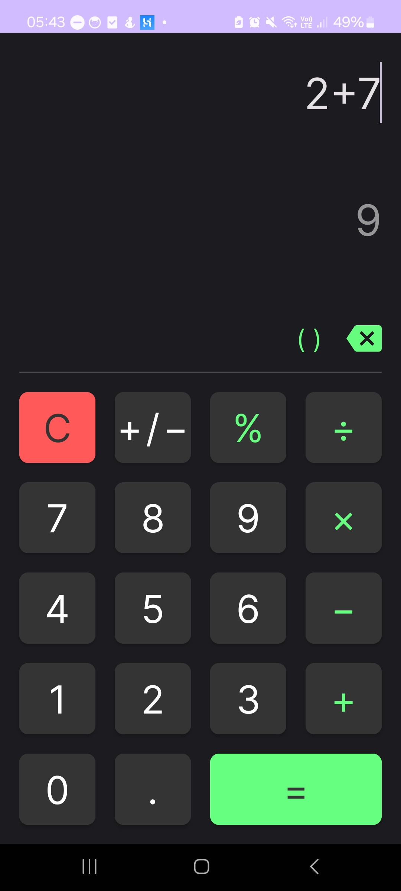
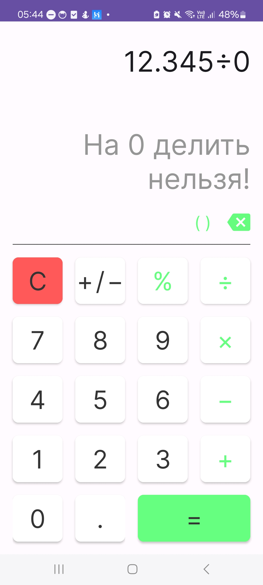
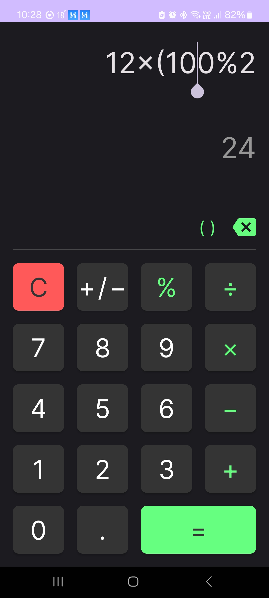
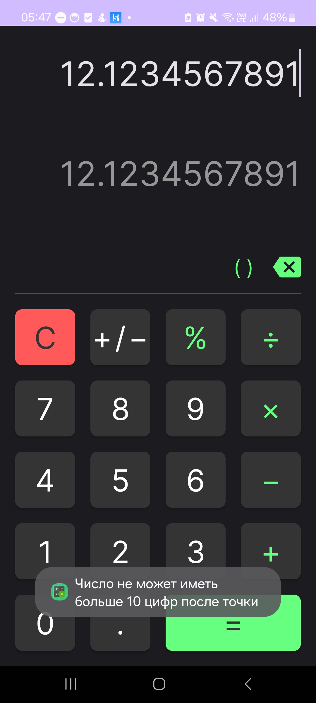

# Calculator App

This is a simple calculator app developed in Kotlin for Android devices. The app provides basic arithmetic operations such as addition, subtraction, multiplication, and division, along with additional features like percentage calculations, parentheses for grouping expressions, and free navigation within the input field.
## Screenshots
|  |  |  |  |
|-----|-----|-----|-----|

## Features

- Addition (+)
- Subtraction (-)
- Multiplication (*)
- Division (/)
- Percentage (%)
- Parentheses for grouping expressions
- Free navigation within the input field

## Usage

1. **Arithmetic Operations**: Use the buttons labeled with mathematical operators (+, -, *, /) to perform basic arithmetic calculations.
2. **Percentage Calculations**: Utilize the percentage button (%) to calculate percentages of numbers.
3. **Parentheses**: Use parentheses for grouping expressions to control the order of operations.
4. **Navigation**: Navigate freely within the input field to edit or modify calculations as needed.
